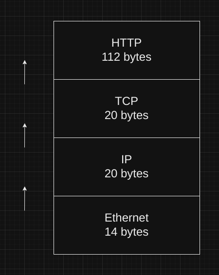

# COMPUTER NETWORKS - LAB-1

## PART-1

- Q1. Hand in your packet drawing.
    
    

- Q2. Estimate the download protocol overhead on packet 7 in the given trace.

    - Total Packet size:    `1484 bytes`
    - Protocol Header size: (14+20+20)    = `54`
    - Protocol Overhead:    54/1484       = `3.64%`

 

- Q3. Estimate the download protocol overhead for the entire HTTP response, as defined above.

    - Total Download Size = `15717` bytes
    - Overhead = `780` bytes
    - Download protocol overhead for the entire HTTP response = `4.96%`

 

- Q4: Which Ethernet header field is the demultiplexing key indicating that the next higher layer is IP? What value is used in this field to    indicate IP?

    - Field: `Type`
    - Value: `IPv4`

 

- Q5: Which IP header field is the demultiplexing key indicating that the next higher layer is TCP? What value is used in this field to
indicate TCP?

    - Field: `Protocol`
    - Value: `TCP(6)`

 

- Q6: Why doesn't TCP's header contain a demultiplexing key? How can TCP know to deliver the data to HTTP on the receiving side?

    - TCP header doesn't coontain the demultiplexing key because the TCP rely on the source & destination port numbers to perform demultiplexing.

## PART-2

- Q1. Is your browser running HTTP version 1.0, 1.1, or 2? What version of HTTP is the server running?

    - Client: HTTP 1.1
    - Server: HTTP 1.1

 

- Q2. What languages (if any) does your browser indicate that it can accept to the server?
    
    - Accept-Language: `en-GB,en-US;q=0.9,en;q=0.8`

 

- Q3. What is the IP address of your computer? What is the IP address of the gaia.cs.umass.edu server?

    - Client: `192.168.137.184`
    - gaia.cs.umass.edu: `128.119.245.12`

 

- Q4. What is the status code returned from the server to your browser?

    - Status code: `200`

 

- Q5. When was the HTML file that you are retrieving last modified on the server?

    - `Fri, 01 Sep 2023 05:59:02 GMT`

 

- Q6. How many bytes of content are being returned to your browser?
    
    - Content length: `128`

 

- Q7. By inspecting the raw data in the packet content window, do you see any headers within the data that are not displayed in the packet-listing window? If so, name one.

    - `NO`, I don't see any difference between the headings of two windows.

 

- Q8. Inspect the contents of the first HTTP GET request from your browser to the server. Do you see an “IF-MODIFIED-SINCE” line in the HTTP GET?
    
    - `NO`, there isn't any IF-MODIFIED-SINCE line in the GET message.

 

- Q9. Inspect the contents of the server response. Did the server explicitly return the contents of the file? How can you tell?

    - The contents of the file were expressly returned by the server. In the "Line-Based Text Data" area of Wireshark, you can see exactly what the server returned to my browser—that is, what the website displayed when I opened it in my browser.

 

- Q10. Now inspect the contents of the second HTTP GET request from your browser to the server. Do you see an “IF-MODIFIED-SINCE:” line in the HTTP GET? If so, what information follows the “IF-MODIFIED-SINCE:” header?

    - `YES`, there is an IF-MODIFIED-SINCE line in the second HTTP message. The time and date that I last accessed the website are listed below.

 

- Q11. What is the HTTP status code and phrase returned from the server in response to this second HTTP GET? Did the server explicitly return the contents of the file? Explain.

    - The HTTP status code is `304: Not Modified``. Yes, there is an IF-MODIFIED-SINCE line in the second HTTP message. The time and date that I most recently accessed the website are listed below.Because the browser just fetched the data from its cache, the server did not return the file's contents. It would have provided the file's contents if it had changed since it was last viewed, but instead it instructed my browser to get the previous version of the file from its cached memory.

 

- Q12. How many HTTP GET request messages did your browser send? Which packet number in the trace contains the GET message for the Bill or Rights?

    - Only 1 request was sent by the browser. The packet number was **`63`**. 

 

- Q13. Which packet number in the trace contains the status code and phrase associated with the response to the HTTP GET request?

    - The packet number **`75`** contains the status code and phrase associated with the response to the HTTP GET request. 

 

- Q14. What is the status code and phrase in the response?

    - The status code is: `200` and the phrase is `OK`.

 

- Q15. How many data-containing TCP segments were needed to carry the single HTTP response and the text of the Bill of Rights?

    - `3` TCP segments were needed to carry the single HTTP response.

 

- Q16. How many HTTP GET request messages did your browser send? To which Internet addresses were these GET requests sent?

    - `3` HTTP GET request messages were sent.

        1. /wireshark-labs/HTTP-wireshark-file4.html → 128.119.245.12
        2. /pearson.jpg → 128.119.245.12
        3. /8E_cover_small.jpg → 178.79.137.164

 

- Q17. Can you tell whether your browser downloaded the two images serially, or whether they were downloaded from the two websites in parallel? Explain.

    - The browser serially downloaded the two photos. Because the browser sent the first image before asking for the second one. Both files would have been requested and delivered simultaneously if they had been running in parallel. However, in this instance, the second image wasn't requested until after the first image was returned.

 

- Q18. What is the server’s response (status code and phrase) in response to the initial HTTP GET message from your browser?
    - `401 Authentication Required`

 

- Q19. When your browser sends the HTTP GET message for the second time, what new field is included in the HTTP GET message?

    - The authorisation field is the new field that has been added. This is included because we informed the server that we were authorized to access the page by sending it a username and password along with our request.
